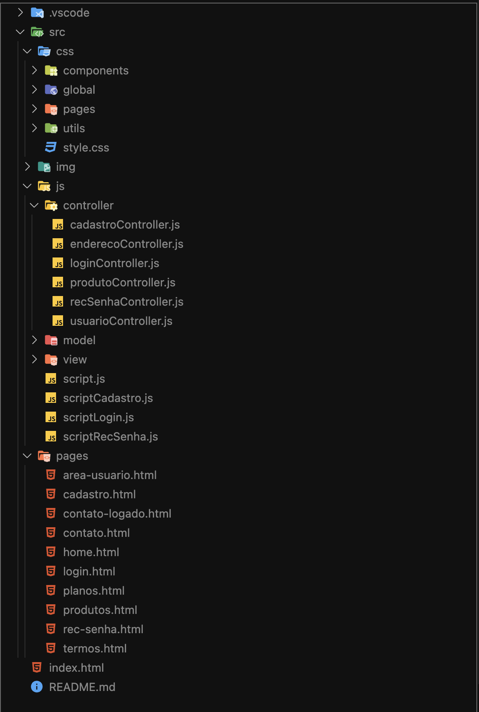

# The Frontenders/ GeekBox
Este projeto consistiu em desenvolver o front end para apresentar uma plataforma
de serviço por assinatura em que as pessoas usuárias precisam entrar em uma lista
de espera.

## Tecnologias Utilizadas
O projeto foi desenvolvido utilizando as seguintes tecnologias:

**TRELLO**: Utilizado para a divisão das tarefas.
**FIGMA**: Utilizado para a criação do design do site.
**UNSPLASH**: Utilizado para a curadoria de imagens.
**BRANCHES/GitHub**: Utilizado para trabalhar em grupo com mais facilidade.
**HTML**: Utilizado para estruturar o conteúdo da página.  
**CSS**: Utilizado para estilizar a página e torná-la visualmente atraente.  
**JavaScript**: Utilizado para manipular o Document Object Model (DOM), implementar a lógica de conversão de unidades e interagir com o usuário.

## Estrutura do Projeto

## Funcionalidades
O site possui as seguintes funcionalidades:

- Login;
- Recuperação de senha;
- Área de cadastro para assinatura da box.

## Executar o projeto
- Para visualizar o preview online do projeto clique [aqui](https://github.com/Vimlm/geekBox);

## Visualizar o projeto
- Clicando [aqui](????) você consegue ver ele online;
- Caso prefira faça o clone do projeto em uma pasta de sua preferência e abra a pasta em um editor de texto da sua preferência;

## Conclusão
O projeto GeekBox consiste em 11 páginas navegaveis, nas quais apresentamos a empresa e os serviços de assinatura, sendo eles em três modalidades, que variam de acordo com o tamanho/valor da box (P, M ou G).
